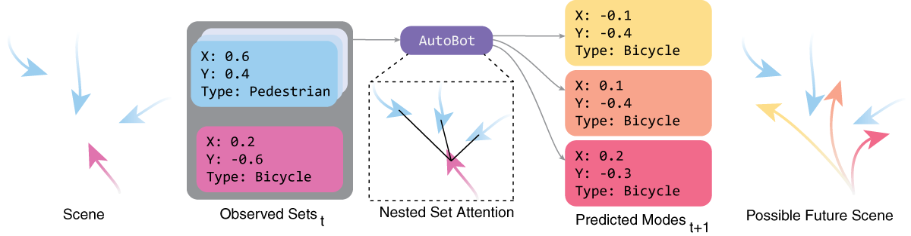
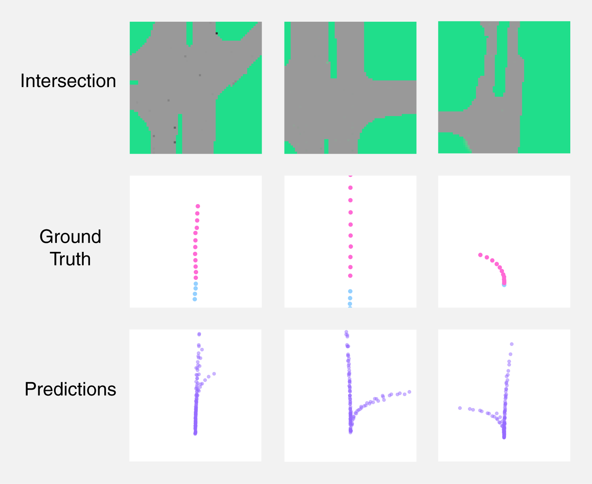

 

TL;DR: ...TODO Enter cute lil summary here 

## Abstract

Humans have the innate ability to attend to the most relevant actors in their vicinity and can forecast how they may behave in the future. This ability will be crucial for the deployment of safety-critical agents such as robots or vehicles which interact with humans. We propose a theoretical framework for this problem setting based on autoregressively modelling sequences of nested sets, using latent variables to better capture multimodal distributions over future sets of sets. We present a new model architecture which we call a Nested Set Transformer which employs multi-head self-attention blocks over sets of sets that serve as a form of social attention between the elements of the sets at every timestep. Our approach can produce a distribution over future trajectories for all agents under consideration, or focus upon the trajectory of an ego-agent. We validate the Nested Set Transformer for autonomous driving settings which we refer to as ("AutoBot"), where we model the trajectory of an ego-agent based on the sequential observations of key attributes of multiple agents in a scene. AutoBot produces results better than state-of-the-art published prior work on the challenging nuScenes vehicle trajectory modeling benchmark. We also examine the multi-agent prediction version of our model and jointly forecast an ego-agent's future trajectory along with the other agents in the scene. We validate the behavior of our proposed Nested Set Transformer for scene level forecasting with a pedestrian trajectory dataset.

## Paper

The paper can be found on arXiv.org:

[arxiv-id](#) (TODO after release)

## Code

The full repo will be released soon. 

In the meantime, we provided an easy-to-follow proof of concept including a toy dataset here:

[https://gist.github.com/fgolemo/b762ddc59c83ca19cd15f3767e2c3780](https://gist.github.com/fgolemo/b762ddc59c83ca19cd15f3767e2c3780)

## Examples

    

On the challenging NuScenes dataset, our model learns plausible paths through intersections. Top row: intersection birdseye view, middle: ground truth input (cyan) and output (magenta) trajectory, bottom: learned plausible paths for the agent.

## Bibtex

TODO after arxiv