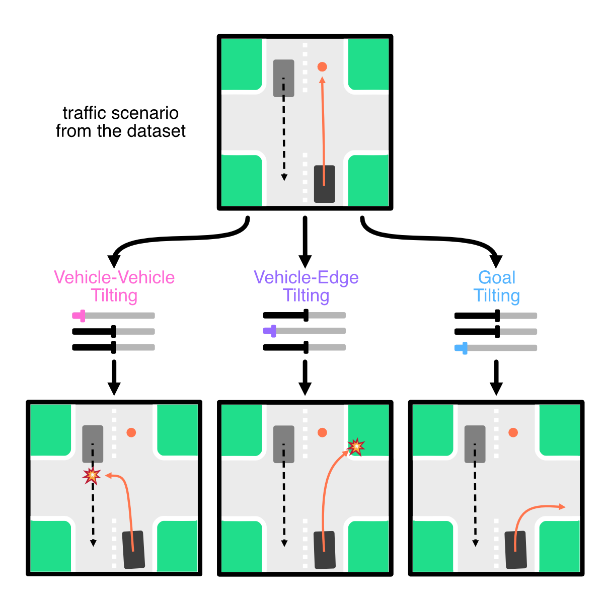
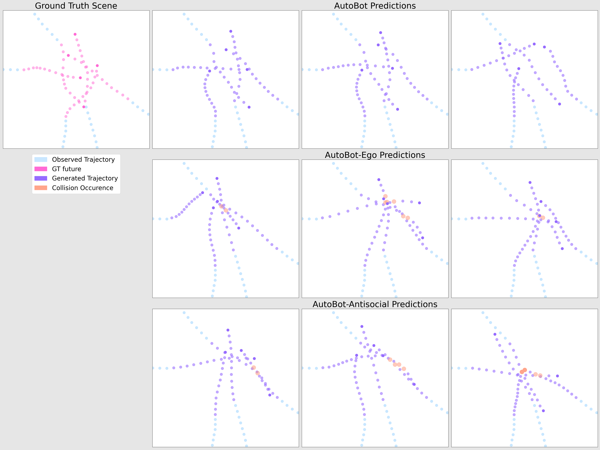

Description

<!-- <canvas id="canvas">
</canvas>
 -->

TL;DR: TODO

## Abstract

Evaluating autonomous vehicle stacks (AVs) in simulation typically involves replaying driving logs from real-world recorded traffic. 
However, agents replayed from offline data do not react to the actions of the AV, and their behaviour cannot be easily controlled to simulate counterfactual scenarios.
Existing approaches have attempted to address these shortcomings by proposing methods that rely on heuristics or learned generative models of real-world data but these approaches either lack realism or necessitate costly iterative sampling procedures to control the generated behaviours.
In this work, we take an alternative approach and propose CtRL-Sim, a method that leverages return-conditioned offline reinforcement learning within a physics-enhanced Nocturne simulator to efficiently generate reactive and controllable traffic agents.
Specifically, we process real-world driving data through the Nocturne simulator to generate a diverse offline reinforcement learning dataset, annotated with various reward terms.
With this dataset, we train a return-conditioned multi-agent behaviour model that allows for fine-grained manipulation of agent behaviours by modifying the desired returns for the various reward components.
This capability enables the generation of a wide range of driving behaviours beyond the scope of the initial dataset, including those representing adversarial behaviours.
We demonstrate that CtRL-Sim can efficiently generate diverse and realistic safety-critical scenarios while providing fine-grained control over agent behaviours. Further, we show that fine-tuning our model on simulated safety-critical scenarios generated by our model enhances this controllability. 

## Paper

TODO
<!-- The paper can be found on arXiv.org: [https://arxiv.org/abs/2104.00563](https://arxiv.org/abs/2104.00563)

The work was originally published on 19th Feb 2021 and got [**accepted at ICLR 2022 as spotlight**](https://openreview.net/forum?id=Dup_dDqkZC5)

Video/poster will follow soon. -->

## Code

TODO
<!-- The full repo is available in Pytorch [here](https://github.com/roggirg/AutoBots). -->

## Examples
<!-- 
### Nuscenes

    

On the challenging NuScenes dataset, our model learns plausible paths through intersections. 
Top row: intersection birdseye view with ground truth input (cyan) and output (magenta) trajectory.
Bottom row: learned plausible paths for the agent.

### TrajNet++ Synthetic Data

    

The synthetic partition of the TrajNet++ dataset is designed to include a high-level of interaction 
between agents.
The top-row shows the performance of our full model (labelled "AutoBot") which predicts scene-consistent
and plausible future scenes across its 3 different modes.
We contrast this to two other AutoBot variants which do not employ social attention in the decoder (middle-row, 
AutoBot-Ego), or in both the encoder and decoder (bottom-row, AutoBot-Antisocial).

### Computational Efficiency

    
    

Conventional methods employ autoregressive decoding to generate the future scene 
which can make such methods slow at inference time. One of the main contributions
of AutoBots is the use of learnable seed parameters in the decoder which allows it to predict the entire
future scene with a single forward pass. Here we show how increasing the number of agents, the number of 
input timesteps, the prediction horizon and the number of discrete modes affect the inference speed (in FPS)
of AutoBot-Ego (top-row) and AutoBot (bottom-row). We can see that models with the decoder seed parameters
can perform real-time inference (>30FPS) for almost all configurations, while autoregressive counterparts
struggle depending on the configuration. **All runs were performed on a single desktop GPU (1080 Ti).**
 -->

## Bibtex

TODO

    @inproceedings{
      girgis2022latent,
      title={Latent Variable Sequential Set Transformers for Joint Multi-Agent Motion Prediction},
      author={Roger Girgis and Florian Golemo and Felipe Codevilla and Martin Weiss and Jim Aldon D'Souza and Samira Ebrahimi Kahou and Felix Heide and Christopher Pal},
      booktitle={International Conference on Learning Representations},
      year={2022},
      url={https://openreview.net/forum?id=Dup_dDqkZC5}
    }
