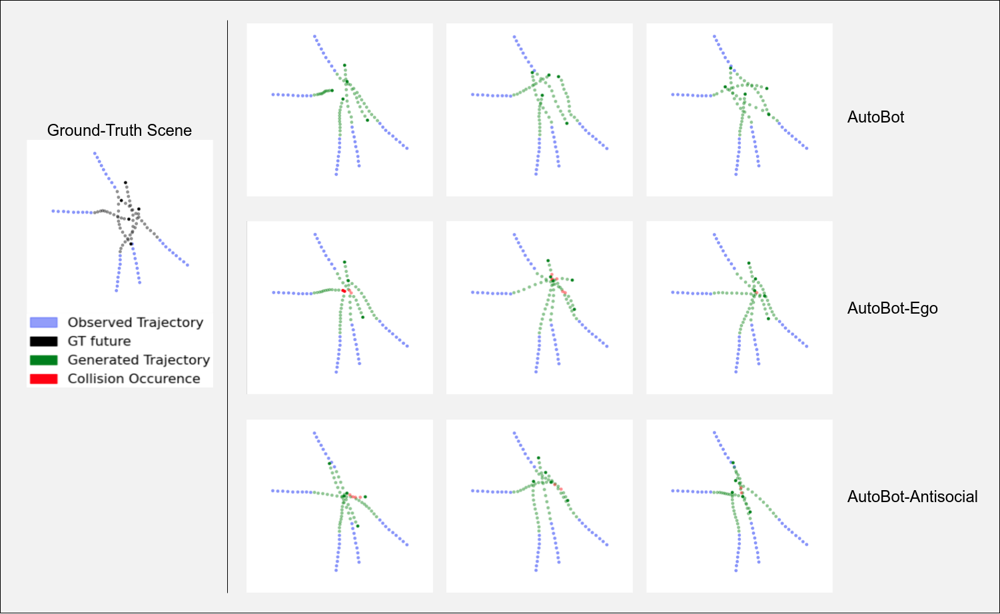
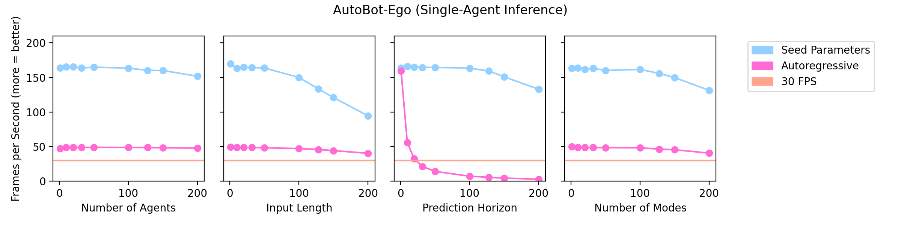
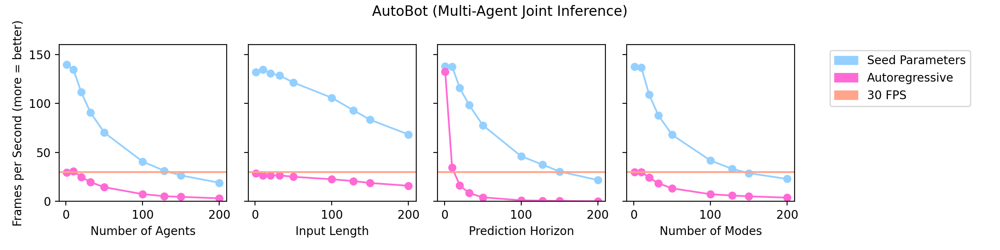

 

TL;DR: We propose a framework for obtaining multimodal distributions 
over the future evolution of elements in sets based on latent variables and Transformer-based 
modelling of sequences. Based on the framework, we introduce a class of model architectures
called **AutoBots** that use multi-head self-attention blocks for social attention between elements 
and for modelling the time-evolution of individual elements in the set. With the use of learnable 
seed parameters in the decoder, AutoBots are computationally efficient and can be used for real-time 
inference. We validate AutoBots in the context of motion prediction for autonomous driving where we 
achieve strong results on the Nuscenes dataset. We further demonstrate its multi-agent forecasting 
performance on a synthetic pedestrian dataset.

## Abstract

Robust multi-agent trajectory prediction is essential for the safe control of robotic systems. 
A major challenge is to efficiently learn a representation that approximates the true joint 
distribution of contextual, social, and temporal information to enable planning. 
We propose Latent Variable Sequential Set Transformers which are encoder-decoder architectures 
that generate scene-consistent multi-agent trajectories. We refer to these architectures as "AutoBots". 
The encoder is a stack of interleaved temporal and social multi-head self-attention (MHSA) modules 
which alternately perform equivariant processing across the temporal and social dimensions. 
The decoder employs learnable seed parameters in combination with temporal and social MHSA modules 
allowing it to perform inference over the entire future scene in a single forward pass efficiently. 
AutoBots can produce either the trajectory of one ego-agent or a distribution over the future 
trajectories for all agents in the scene. For the single-agent prediction case, our model achieves 
top results on the global nuScenes vehicle motion prediction leaderboard, and produces strong results 
on the Argoverse vehicle prediction challenge. In the multi-agent setting, we evaluate on the synthetic 
partition of TrajNet++ dataset to showcase the model's socially-consistent predictions. We also 
demonstrate our model on general sequences of sets and provide illustrative experiments modelling the 
sequential structure of the multiple strokes that make up symbols in the Omniglot data. A distinguishing 
feature of AutoBots is that all models are trainable on a single desktop GPU (1080 Ti) in under 48h.

## Paper

The paper can be found on arXiv.org: [https://arxiv.org/abs/2104.00563](https://arxiv.org/abs/2104.00563)

## Code

The full repo will be released soon. 

In the meantime, we provided an easy-to-follow proof of concept including a toy dataset here:

[https://gist.github.com/fgolemo/b762ddc59c83ca19cd15f3767e2c3780](https://gist.github.com/fgolemo/b762ddc59c83ca19cd15f3767e2c3780)

## Examples

### Nuscenes

    

On the challenging NuScenes dataset, our model learns plausible paths through intersections. 
Top row: intersection birdseye view with ground truth input (cyan) and output (magenta) trajectory.
Bottom row: learned plausible paths for the agent.

### TrajNet++ Synthetic Data

    

The synthetic partition of the TrajNet++ dataset is designed to include a high-level of interaction 
between agents.
The top-row shows the performance of our full model (labelled "AutoBot") which predicts scene-consistent
and plausible future scenes across its 3 different modes.
We contrast this to two other AutoBot variants which do not employ social attention in the decoder (middle-row, 
AutoBot-Ego), or in both the encoder and decoder (bottom-row, AutoBot-Antisocial).

### Computational Efficiency

    
    

Conventional methods employ autoregressive decoding to generate the future scene 
which can make such methods slow at inference time. One of the main contributions
of AutoBots is the use of learnable seed parameters in the decoder which allows it to predict the entire
future scene with a single forward pass. Here we show how increasing the number of agents, the number of 
input timesteps, the prediction horizon and the number of discrete modes affect the inference speed (in FPS)
of AutoBot-Ego (top-row) and AutoBot (bottom-row). We can see that models with the decoder seed parameters
can perform real-time inference (>30FPS) for almost all configurations, while autoregressive counterparts
struggle depending on the configuration. All runs were performed on a single desktop GPU (1080 Ti).

## Bibtex

    @inproceedings{Girgis2021LatentVS,
      title={Latent Variable Sequential Set Transformers For Joint Multi-Agent Motion Prediction},
      author={Roger Girgis and Florian Golemo and Felipe Codevilla and Martin Weiss and Jim Aldon D'Souza and Samira Ebrahimi Kahou and Felix Heide and Christopher Joseph Pal},
      year={2021}
    }
